# Students Management (Stroika)

A school portal for managing students, parents, timetables, and staff accounts. The frontend is a React (CRA) app with Material UI; the demo backend is **JSON Server** with **json-server-auth** (JWT) and custom Express routes in `server/server.js`. Data persists in `server/db.json`.

---

## Quick start

```bash
npm install
npm start
```

This runs the API on **port 3101** and the React app on **port 3000** (see `package.json` scripts).

Optional: set `REACT_APP_SERVER_URL` if the API is not proxied (default proxy: `http://localhost:3101`).

```bash
npm run build    # production build
npm run server   # API only
npm run client   # React only
```

---

## Roles

- **Admin** — full access, including user management, site settings, grades/classes, courses, student tags, and timetable editing.
- **Teacher** — students (per permissions), parents, timetable (assigned classes), reminders, CSV export, and conflict warnings.
- **Student** — read-only views for own profile, parents, and timetable (after linking a class).

---

## Feature overview

### Authentication and profile

- JWT login via json-server-auth; inactive accounts are blocked at login.
- Edit profile and change password.
- Theme: brand color from site settings, light/dark mode, RTL-friendly layout (e.g. Arabic).
- Global search for students and parents.

### Home dashboard

- Welcome card and role-specific overview.
- **Admin:** reports and analytics block (accounts and record counts).
- **Birthdays this month** — students with a date of birth in the current calendar month (active students only).
- **Recently opened** — last few student profiles opened from the Students page (stored in the browser).
- Quick actions to Students, Parents, and admin areas.

### Students

- List with **card** or **table** view; search; filter by grade and section.
- Student drawer: personal data, **internal note** (staff; hidden for student accounts), class/section, parents, household members.
- **Tags** — multi-select labels (managed under Site settings); **filter by tag** and **Show inactive** in the toolbar.
- **Active / inactive** flag (admins can toggle when adding or editing).
- **Last updated** timestamp (view mode, staff).
- **Export CSV** exports the **currently filtered** list (not the full database list).
- **Print** student profile (print-friendly HTML).
- Empty state with hints and links to **Grades & classes** and **Courses** (admins).

### Parents

- CRUD for guardian records linked to students.
- **Search** by name, email, or phone.
- **Export CSV** for the filtered list.
- Empty onboarding with a shortcut to the Students page.

### Timetable

- Staff: pick grade and section, edit weekly grid (course, teacher, room), save per class.
- Students: read-only timetable after choosing a class (where allowed).
- **Print / PDF** — opens a print-friendly timetable for the current class.
- **Conflict warning** — if the same teacher is scheduled in more than one class at the same day/period, a banner lists conflicts (data comes from `timetableCells` in timetable config).
- Empty state with admin link to **Grades & classes**.

### Reminders (teachers / staff)

- Private reminders with title, optional **due date**, and notes.
- **Filters:** All, Today, This week, Overdue (reminders without a due date appear only under **All**).

### Admin

- **Users** — create/edit/delete accounts, roles, active flag, student link.
- **Teachers** — manage teacher accounts and class assignments; timetable preview.
- **Site settings** — school info, email placeholders, theme, weekly calendar rules.
- **Back up your data** — reminder card with copy-to-clipboard path `server/db.json` (relative to project root).
- **Student tags** — create and delete tags (deleting removes the tag from all students).
- **Grades & classes** — structure for sections used in timetables and student assignment.
- **Courses** — catalog used in timetable cells.

---

## Screenshots

Add PNG or JPG files under `docs/screenshots/` (create the folder if needed) and either keep the filenames below or update the paths in this table.

| Area | Suggested filename | Placeholder |
|------|--------------------|-------------|
| Login | `01-login.png` | 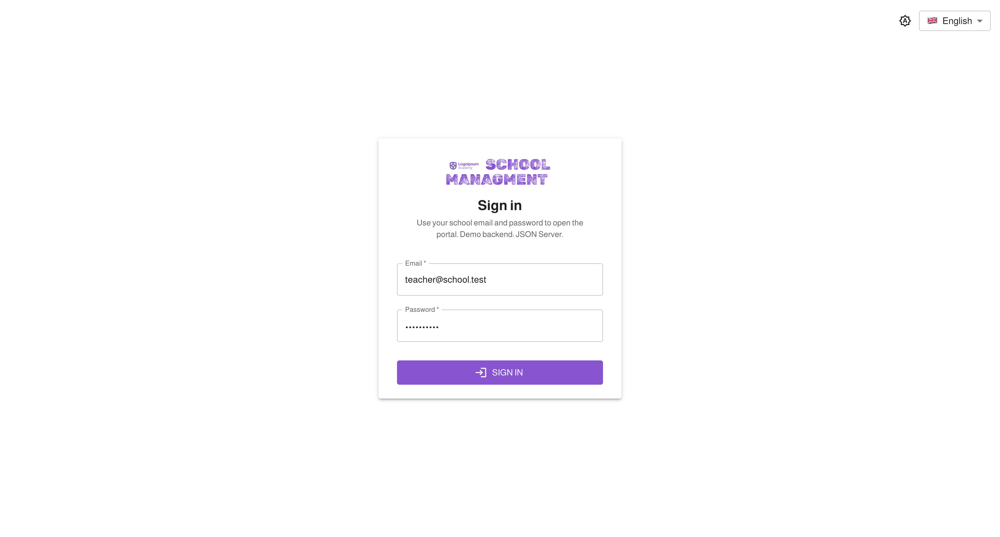 |
| Home dashboard | `02-home.png` | 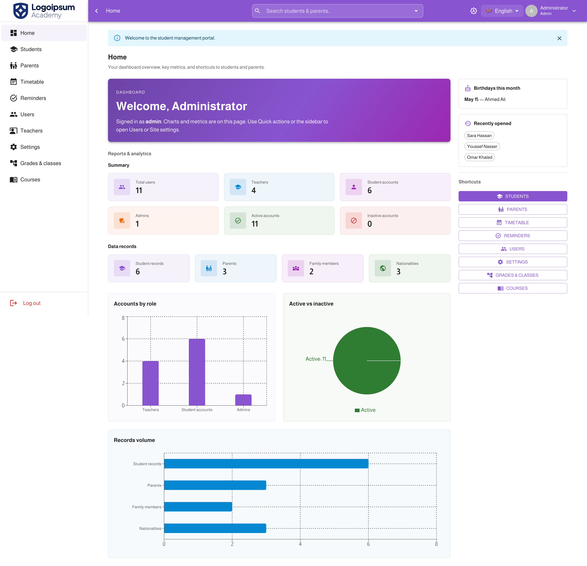 |
| Students (cards) | `03-students-cards.png` | 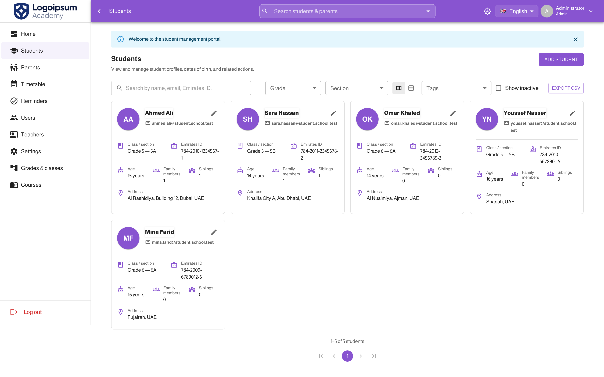 |
| Students (table / filters) | `04-students-table.png` | 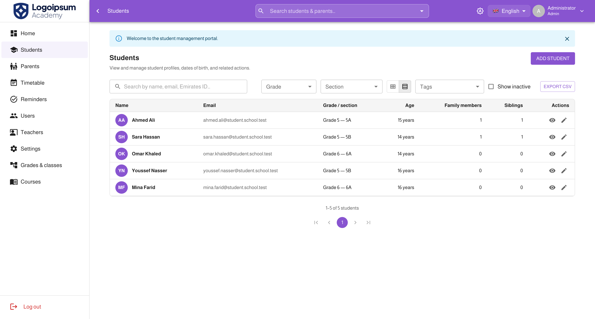 |
| Student profile drawer | `05-student-drawer.png` | 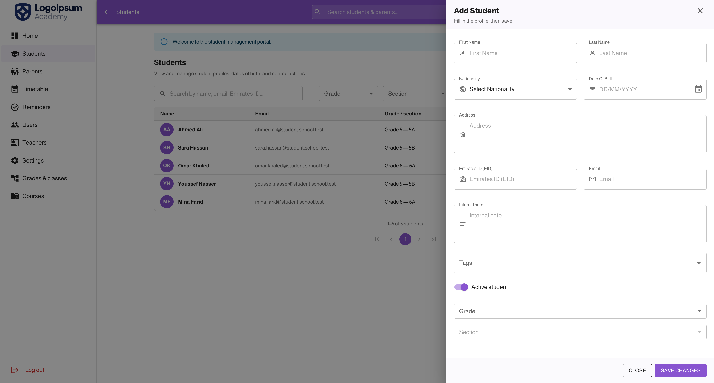 |
| Parents | `06-parents.png` | 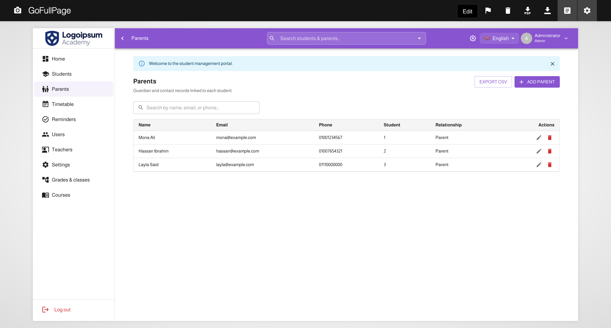 |
| Timetable | `07-timetable.png` | 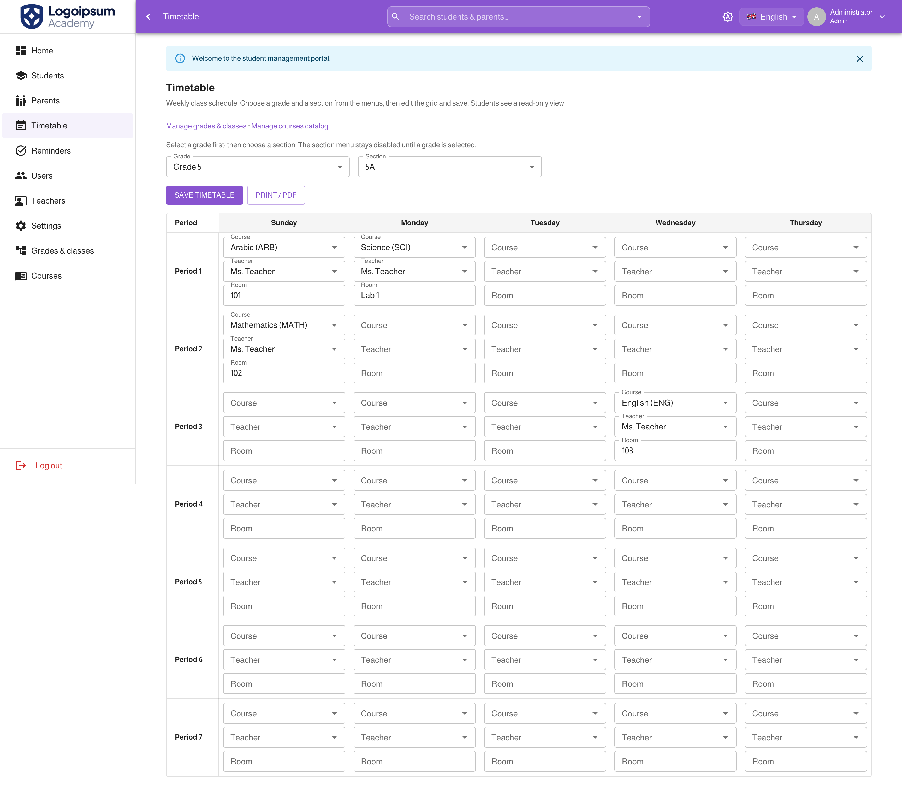 |
| Timetable conflicts banner | `08-timetable-conflicts.png` | 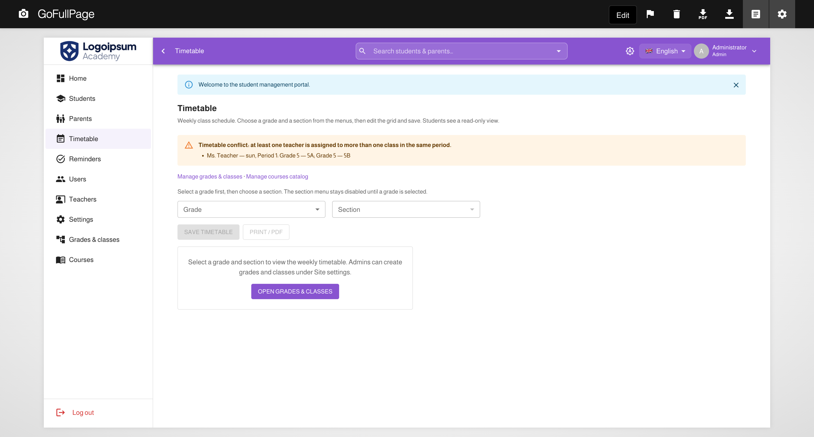 |
| Reminders | `09-reminders.png` | 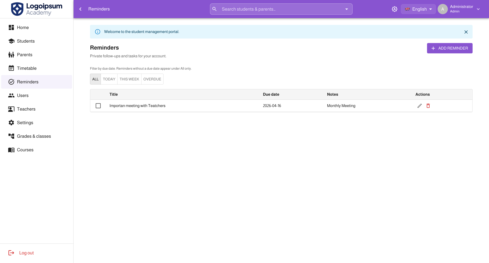 |
| Site settings (general + tags) | `10-settings.png` | 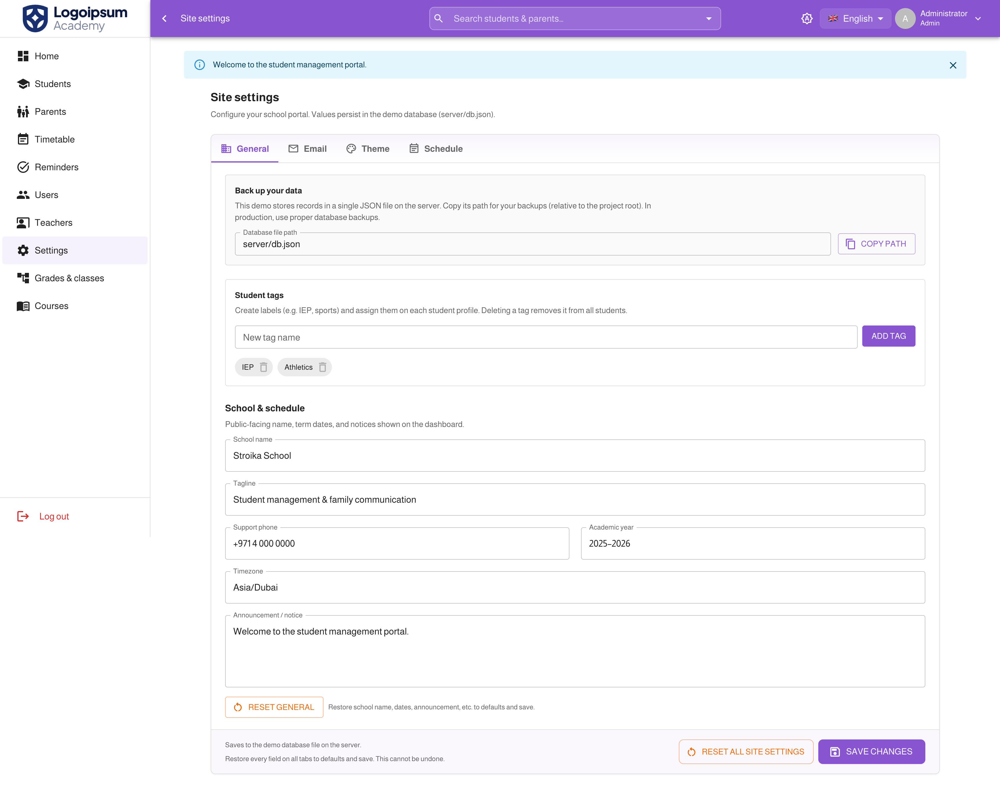 |
| Admin users | `11-admin-users.png` | 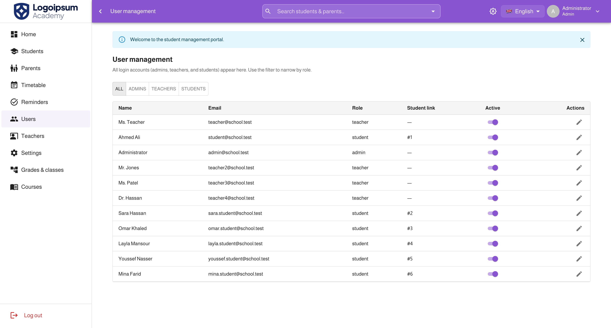 |

### Larger hero / gallery (optional)

You can reuse the same files or add wide banners:

```text
docs/screenshots/hero-dashboard.png   — main marketing / README hero
docs/screenshots/gallery-01.png
docs/screenshots/gallery-02.png
```


---

## Project layout (high level)

```text
server/
  server.js      # Express + json-server + custom API routes
  db.json        # Demo database (students, users, timetable, tags, …)
src/
  api/           # Axios clients and normalizers
  components/    # Shared UI (table, modal, timetable grid, …)
  pages/         # Route screens
  locales/       # en.json, ar.json
  utils/         # CSV export, print helpers, timetable conflicts, birthdays, recent students
```

---

## API notes

- Authenticated routes expect `Authorization: Bearer <token>`.
- Student create/update are handled by custom `POST /students` and `PUT /students/:id` (staff) so `createdAt` / `updatedAt` are set automatically.
- Student tags: `GET /api/student-tags` (auth); create/update/delete (admin) as documented in `server/server.js`.

---

## License

Private project (`private: true` in `package.json`). Adjust as needed for your school or organization.
